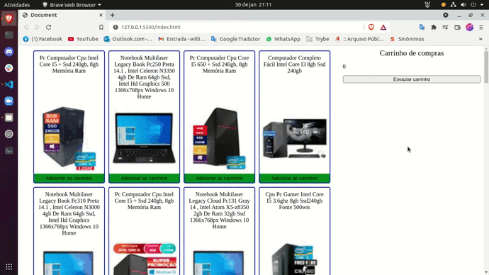

### Observação

Este repositório contem o Projeto Trybewarts que reúne o aprendizado desenvolvido por _[Willian Alves Batista](https://www.linkedin.com/in/willian-alves-batista-60aa6a180/)_ enquanto estudante da [Trybe](https://www.betrybe.com/) :rocket:
**GitHub [Trybe](https://github.com/tryber)**.

# Projeto Shopping Cart
### Resultado obtido:

#### Habilidades que foram exigidas:

  - Fazer requisições a uma API *(Application Programming Interface)* do Mercado Livre;
  - Utilizar os seus conhecimentos sobre JavaScript, CSS e HTML;
  - Trabalhar com funções assíncronas;
  - Implementar testes unitários.

#### Requisitos obrigatórios que foram realizados:

  - Crie uma listagem de produtos;
  - Adicione o produto ao carrinho de compras;
  - Remova o item do carrinho de compras ao clicar nele;
  - Carregue o carrinho de compras através do **LocalStorage** ao iniciar a página;
  - Some o valor total dos itens do carrinho de compras;
  - Crie um botão para limpar o carrinho de compras;
  - Adicione um texto de "carregando" durante uma requisição à API;
  
 #### Implementação de Testes unitários:
 
  - Desenvolva testes de no mínimo 25% de cobertura total e 100% da função `fetchProducts`;
  - Desenvolva testes de no mínimo 50% de cobertura total e 100% da função `fetchItem`;
  - Desenvolva testes de no mínimo 75% de cobertura total e 100% da função `saveCartItems`;
  - Desenvolva testes para atingir 100% de cobertura total e 100% da função `getSavedCartItems`;
  
### Trybe

_"A Trybe é uma escola do futuro para qualquer pessoa que queira melhorar de vida e construir uma carreira de sucesso em tecnologia, onde a pessoa só paga quando conseguir um bom trabalho."_

